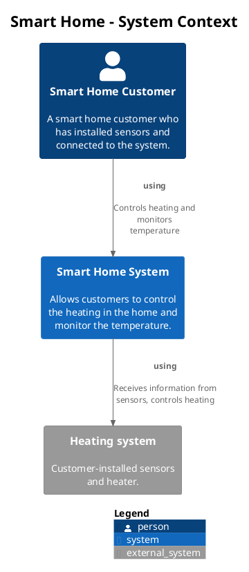
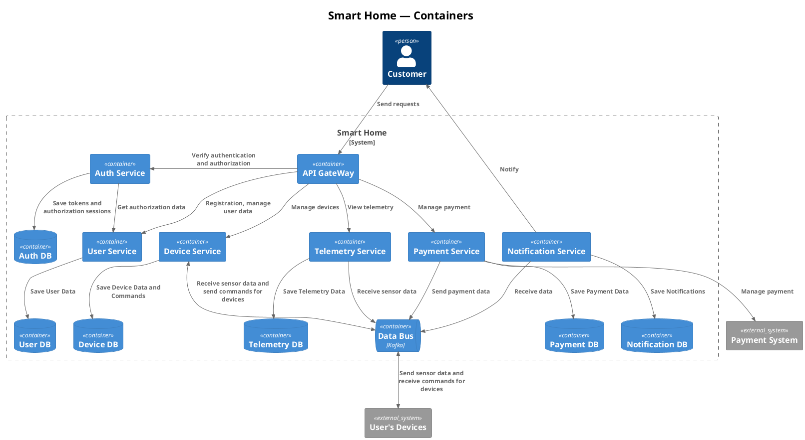
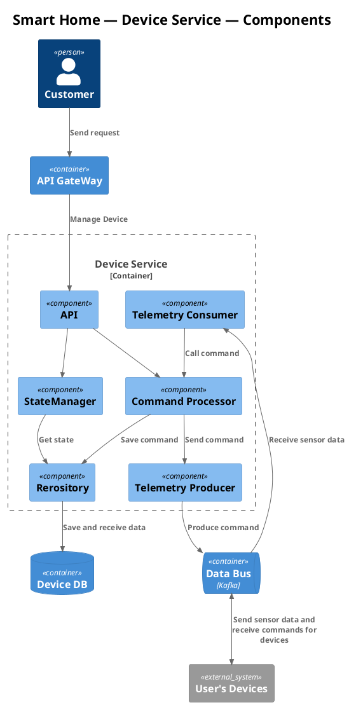
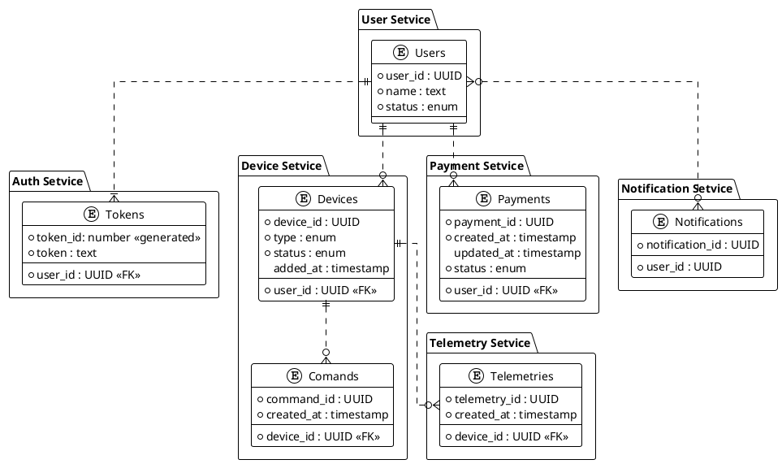

## Анализ и планирование

## функциональность текущего монолитного приложения.

**Управление отоплением:**

- Пользователи могут удалённо включать/выключать отопление в своих домах.
- Пользователи могут устанавливать желаемую температуру.
- Система автоматически поддерживает заданную температуру, регулируя подачу тепла.

**Мониторинг температуры:**

- Система получает данные о температуре с датчиков, установленных в домах.
- Пользователи могут просматривать текущую температуру в своих домах через веб-интерфейс.

## Архитектура монолитного приложения

- **Язык программирования:** Java
- **База данных:** PostgreSQL
- **Архитектура:** Монолитная, все компоненты системы (обработка запросов, бизнес-логика, работа с данными) находятся в рамках одного приложения.
- **Взаимодействие:** Синхронное, запросы обрабатываются последовательно.
- **Масштабируемость:** Ограничена, так как монолит сложно масштабировать по частям.
- **Развертывание:** Требует остановки всего приложения.

**домены и границы контекстов**
- управление устройствами 
	- управление отоплением
- мониторинг датчиков
	- мониторинг температуры
- продажи услуг подключения
	- управление пользователями
	- обработка платежей
		- управление транзакциями



## Архитектура микросервисов

### Containers 



### Components



### ER




___

# Базовая настройка

## Запуск minikube

[Инструкция по установке](https://minikube.sigs.k8s.io/docs/start/)

```bash
minikube start
```


## Добавление токена авторизации GitHub

[Получение токена](https://github.com/settings/tokens/new)

```bash
kubectl create secret docker-registry ghcr --docker-server=https://ghcr.io --docker-username=<github_username> --docker-password=<github_token> -n default
```


## Установка API GW kusk

[Install Kusk CLI](https://docs.kusk.io/getting-started/install-kusk-cli)

```bash
kusk cluster install
```


## Настройка terraform

[Установите Terraform](https://yandex.cloud/ru/docs/tutorials/infrastructure-management/terraform-quickstart#install-terraform)


Создайте файл ~/.terraformrc

```hcl
provider_installation {
  network_mirror {
    url = "https://terraform-mirror.yandexcloud.net/"
    include = ["registry.terraform.io/*/*"]
  }
  direct {
    exclude = ["registry.terraform.io/*/*"]
  }
}
```

## Применяем terraform конфигурацию 

```bash
cd terraform
terraform apply
```

## Настройка API GW

```bash
kusk deploy -i api.yaml
```

## Проверяем работоспособность

```bash
kubectl port-forward svc/kusk-gateway-envoy-fleet -n kusk-system 8080:80
curl localhost:8080/hello
```


## Delete minikube

```bash
minikube delete
```
